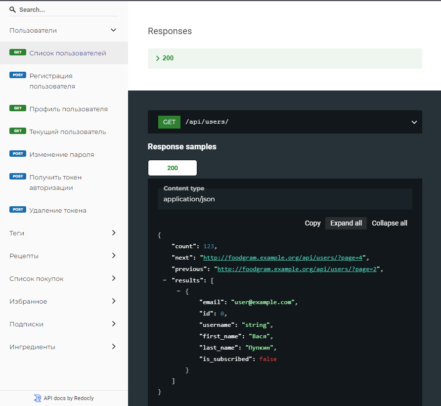
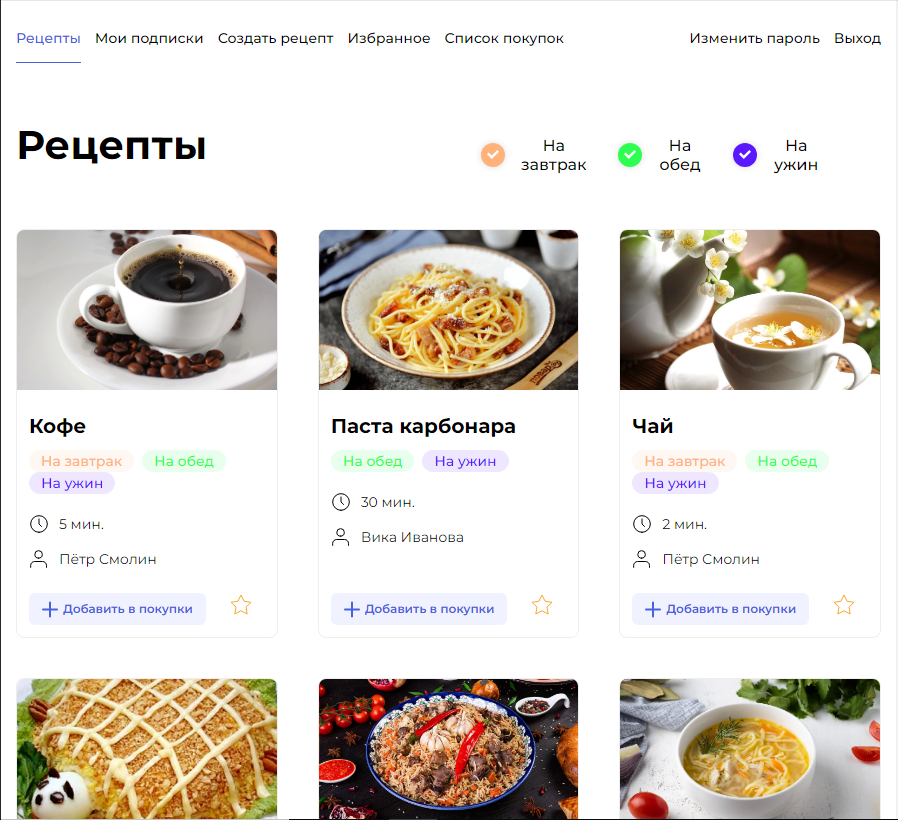
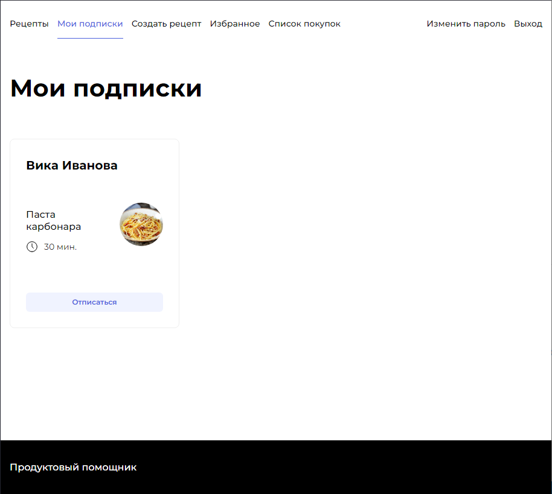
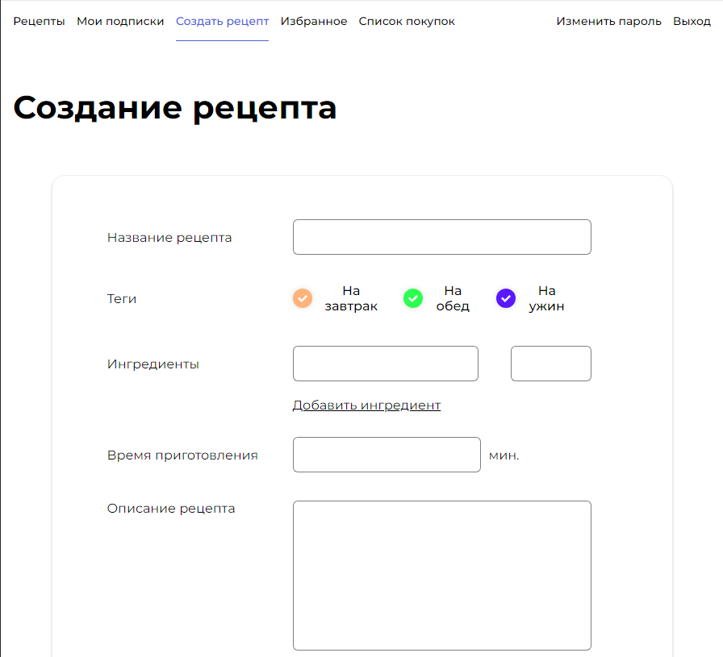
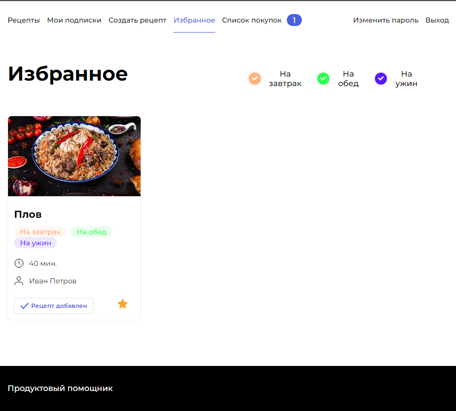
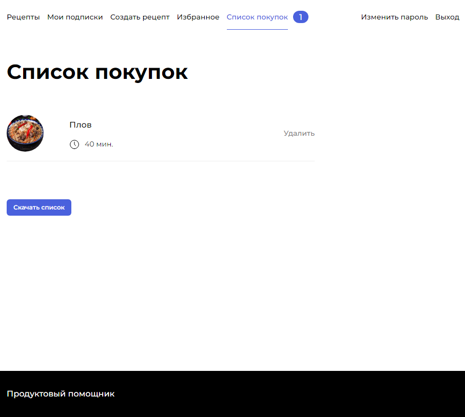
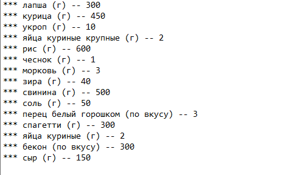

# Foodgram
### Как запустить проект:

Клонировать репозиторий и перейти в infra в командной строке:

```
git clone https://github.com/mixer-sys/foodgram-project-react.git
```

```
cd foodgram-project-react/infra/
```

Cоздать файл .env, пример .env.example. Запустить проект в контейнерах:

```
sudo docker compose -f docker-compose.production.yml up -d
```

Настроить nginx на хосте или сервере, пример конфига /etc/nginx/sites-enabled/default:

```
server {
        server_name server_ip domain_name;
        location / {
                proxy_set_header Host $http_host;
                proxy_pass http://127.0.0.1:7000;
        }

}
```

### Как посмотреть документацию api:

Перейти по адресу: http://server_ip/api/docs/




### Возможности проекта:

Можно смотреть рецепты пользователей, добалять свои, подписываться на пользователей, добавлять рецепты в избранное, добавлять в корзину, получать список ингрединтов, который необходим для приготовления добавленных в корзину блюд.












